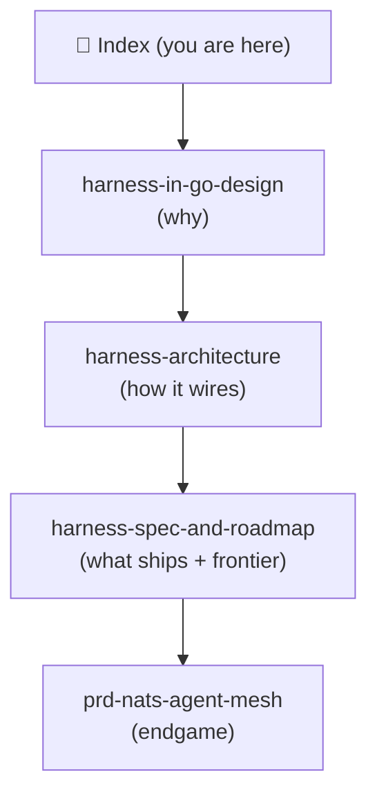

# 🧭 Harness Knowledge Base — Index

> Map of content for the **Pi-in-Go harness** design. Start here.

Open this `docs/` folder directly in Obsidian (**File → Open folder as vault**),
or symlink it into an existing vault. All notes use mermaid + callouts +
`[[wikilinks]]`, which render natively in Obsidian.

## Reading order

1. [[harness-in-go-design]] — **the why.** Porting pi's loop + extensibility to Go;
   the 5 core mechanisms; what survives static compilation and what doesn't.
2. [[harness-architecture]] — **the how it wires.** Package map, the loop, where
   extension points physically live, the SDK tiers (Starlark / WASM / NATS), the
   `Transport` abstraction, the UI decision, and the Crush rendering study.
3. [[harness-spec-and-roadmap]] — **what ships + where we innovate.** The wedge
   (single static binary, in-process only) and the optimization frontier
   (caching, context management, compression, the self-optimizing harness).
4. [[prd-nats-agent-mesh]] — **the endgame.** Embedded NATS agent mesh; broker as
   an implementation detail; supervision.

### Deep dives

- [[caching-and-control-surface]] — prompt caching (provider-owned vs harness-owned),
  prefix cache-busters, and the ranked map of optimizations the harness controls.
- [[observability-and-self-healing]] — one Broker, two sinks; OTel SDK (not collector);
  the baked-in agent-native "Traces" tab vs Langfuse.
- [[storage-and-cgo]] — embeddable DB choice for a distributed CLI, the SQLite
  single-writer problem, and cgo vs pure Go.

## The one-paragraph thesis

A Go core loop (goroutines/channels fit it beautifully) + Starlark for the
logic-plane extensions + compiled-in Go for providers/rich-UI + MCP/NATS for
cross-language and remote — keeps pi's entire conceptual model and almost all of
its power, gains a real sandbox, and turns the harness into something you can run
many of at once. **Ship the in-process wedge first; the mesh is delivery N.**

## Map

## Status

Design phase complete. Next concrete step: **D1 spike** — `agentcore.Run` with
steering/follow-up channels + the `convertToLLM` boundary, no UI/ext yet
(see [[harness-spec-and-roadmap]] Part I).
