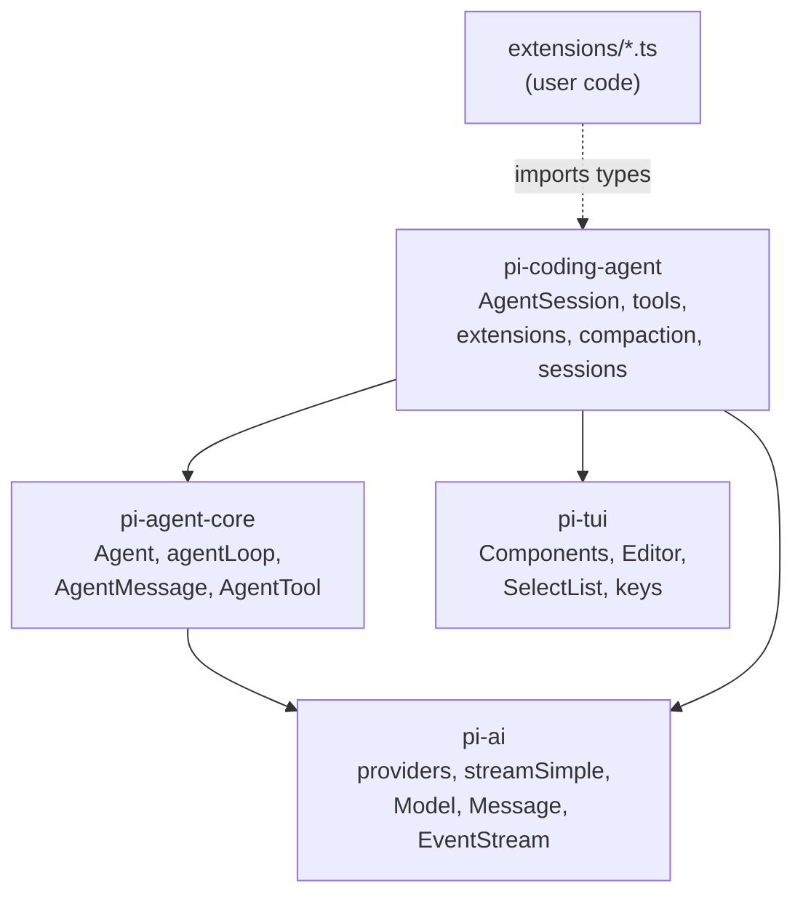
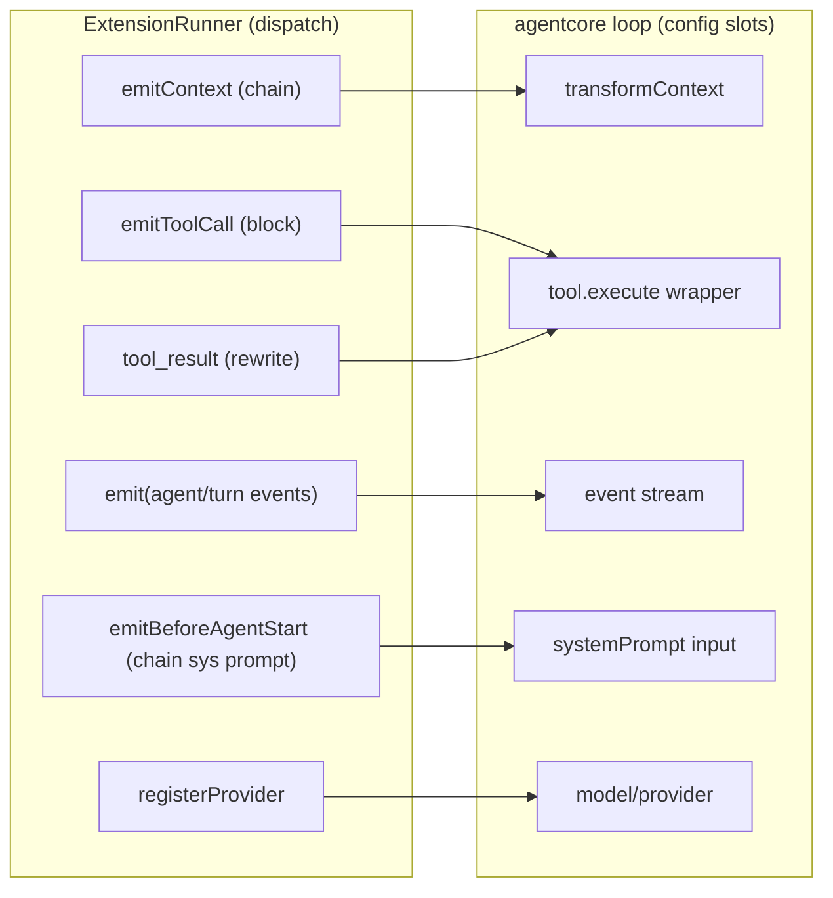
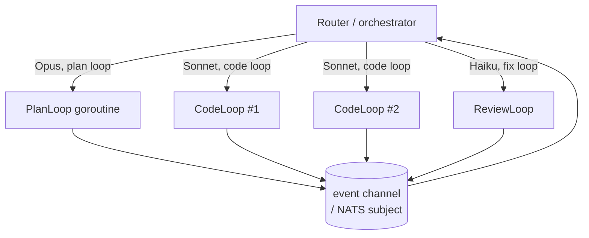
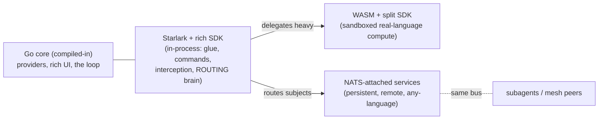

# Pi Harness — Architecture & Go Translation

> Companion to [[harness-in-go-design]]. This is the "how it actually wires
> together" deep-dive: the loop, the package API surface, where the extension
> points physically live, and what Go buys us.

> [!abstract] TL;DR
> The harness is three rings: **loop (mechanism)** → **session (wiring)** →
> **extensions (policy)**. Extensions don't hook "the loop" abstractly — they
> plug into **named slots** on the loop's config (`transformContext`, tool
> wrappers) plus the event stream. In Go those slots are struct fields / an
> interface, and the Starlark host is what fills them.

---

## 1. Package map & dependency graph



> [!note] The one rule
> `pi-agent-core` imports **only** `pi-ai`. It has zero knowledge of tools-on-disk,
> the TUI, sessions, or extensions. Everything product-shaped lives in
> `pi-coding-agent` and *consumes* the loop. Preserve this seam in Go:
> `agentcore` never imports `codingagent` or `ext`.

### API surface, one line each

| Package | Exports (the surface that matters) | Go home |
|---|---|---|
| `pi-ai` | `Model`, `Message`, `streamSimple`, `Api` registry, provider clients, `EventStream`, OAuth | `llm/` |
| `pi-agent-core` | `Agent` class, `agentLoop`/`agentLoopContinue`, `AgentMessage`, `AgentTool`, `AgentEvent`, `AgentLoopConfig` | `agentcore/` |
| `pi-tui` | `Component`, `Editor`, `SelectList`, `Text`, `Markdown`, `Key`/`matchesKey`, themes | `tui/` |
| `pi-coding-agent` | `AgentSession`, built-in tools, `ExtensionAPI`/`ExtensionRunner`, compaction, session manager, model registry | `codingagent/` + `ext/` |

---

## 2. The loop (mechanism ring)

The loop is `agentLoop()` in `pi-agent-core`. The `Agent` class is a thin
stateful wrapper that owns the steering/follow-up queues and translates them
into the loop's config callbacks (`agent.ts:356-393`).


> [!tip] The two loops in one
> **Inner loop** = tool calls + *steering* (interrupt: drop remaining tools, inject
> now). **Outer loop** = *follow-up* (queue: continue after the agent would stop).
> In TS these are awaited queue-drains; in Go they're `select` on two channels.

The loop emits a typed **event stream** the whole time (`agent_start`,
`message_start/update/end`, `tool_execution_start/update/end`, `turn_end`,
`agent_end`). The UI is a pure subscriber — it never calls *into* the loop.

---

## 3. The wiring ring — where extension points physically attach

This is the part that's invisible until you read `sdk.ts` + `agent-session.ts`.
Extensions do **not** patch the loop. The host constructs the `Agent` with the
extension runner's methods *as* the loop's config slots:

```ts
// sdk.ts:287 — the actual wiring
agent = new Agent({
  convertToLlm:     convertToLlmWithBlockImages,           // host policy
  transformContext: (msgs) => runner.emitContext(msgs),    // ← "context" hook lives HERE
  getApiKey:        (provider) => modelRegistry.getKey(provider),
  steeringMode, followUpMode, thinkingBudgets, ...
});
```

And tools are wrapped before `agent.setTools()`:

```ts
// agent-session.ts:1934-1968
const registered = runner.getAllRegisteredTools();          // from pi.registerTool
const tools = wrapRegisteredTools(registered, runner)       // RegisteredTool → AgentTool
  .map(t => wrapToolWithExtensions(t, runner));             // ← "tool_call"/"tool_result" fire HERE
agent.setTools(tools);
```

So every extension capability maps to a **specific slot**:



### The extension-point table (the cheat sheet)

| pi hook (`pi.on(...)`) | Loop slot it fills | Combine policy | Go: where you add it |
|---|---|---|---|
| `context` | `LoopConfig.TransformCtx` | **chain** msgs | `cfg.TransformCtx = runner.EmitContext` |
| `tool_call` | inside tool wrapper, pre-exec | **block**/short-circuit | wrap `Tool.Execute`; check `runner.EmitToolCall` |
| `tool_result` | inside tool wrapper, post-exec | **rewrite** result | same wrapper, after exec |
| `before_agent_start` | system-prompt input | **chain** prompt | call `runner.EmitBeforeAgentStart` before `Run()` |
| `agent_start/end`, `turn_start/end` | event-stream subscriber | fan-out | goroutine ranging the event chan → `runner.Emit` |
| `input`, `user_bash` | pre-loop input pipeline | transform/handle | in the session layer, before `Run()` |
| `registerTool` | `LoopConfig.Tools` | additive | append to tools slice before `Run()` |
| `registerProvider` | model registry | additive | `modelRegistry.Register(...)` (compiled-in Go) |

> [!important] The Go translation is *mechanical*
> You don't invent extension points — you expose the loop's existing config
> slots to the runner, and expose the runner's surface to Starlark. Three rings,
> two adapters.

---

## 4. Extensibility with Starlark — what we offer devs

### What a third-party dev writes

A `.star` file dropped in `.pi/extensions/` (mirrors pi's discovery in
`loader.ts:433`). No compile step, hot-reloadable, sandboxed:

```python
# .pi/extensions/guard.star — block edits to protected paths, add a tool

def on_tool_call(ev, ctx):
    if ev.tool_name == "edit" and ev.input["path"].startswith("infra/"):
        return {"block": True, "reason": "infra/ is protected"}

def wc(call_id, args, ctx):
    res = ctx.exec("wc", ["-l", args["file"]])
    return {"content": [{"type": "text", "text": res.stdout}]}

def setup(pi):
    pi.on("tool_call", on_tool_call)
    pi.register_tool(
        name        = "line_count",
        description = "Count lines in a file",
        parameters  = {"type": "object",
                       "properties": {"file": {"type": "string"}},
                       "required": ["file"]},
        execute     = wc,
    )
```

That's the **logic-plane** — interception + new tools + shelling out. It covers
~80% of real extensions (pi's own `diff.ts` is mostly this: `git status` + a
picker).

### Where in Go the extension point lives — concretely

```mermaid
sequenceDiagram
    participant Disc as discoverExtensions()
    participant Host as ext.StarlarkHost
    participant SL as starlark.ExecFile
    participant Ext as *Extension (record)
    participant Run as ExtensionRunner
    participant Loop as agentcore.Run

    Disc->>Host: Load(".pi/extensions/guard.star")
    Host->>SL: predeclared = {"pi": piModule}
    SL->>Ext: setup(pi) mutates handlers/tools maps
    Note over Host,Ext: PHASE 1 — registration. action builtins error (Runtime=nil)
    Host->>Run: bind(liveRuntime)
    Note over Run: PHASE 2 — actions now live
    Loop->>Run: TransformCtx / tool wrapper / events
    Run->>SL: starlark.Call(handler, ev, ctx)
```

The physical insertion points in Go:

1. **`ext/host.go`** — owns the `*starlark.Thread` and the `pi` module of
   Go-implemented builtins (`pi.on`, `pi.register_tool`, `pi.exec`, …). Each
   builtin parses Starlark args → calls the host-side `ExtensionAPI`.
2. **`ext/extension.go`** — the `*Extension` record: `handlers map[string][]starlark.Callable`,
   `tools map[string]Tool`, etc. `pi.register_*` mutate this. (= pi's
   `loader.ts` Extension object.)
3. **`ext/runner.go`** — `Emit*` walks extensions, invokes handlers via
   `starlark.Call`, applies the per-event combine policy (chain/block/rewrite).
   (= pi's `runner.ts`.)
4. **`codingagent/session.go`** — the wiring: sets `cfg.TransformCtx = runner.EmitContext`,
   wraps tools, subscribes a goroutine to the event channel → `runner.Emit`.
   (= pi's `sdk.ts` + `agent-session.ts`.)

> [!note] Two-phase wiring (don't skip this)
> `pi.register_*` run at load and only build maps. Action builtins
> (`pi.send_message`, `pi.set_model`) read a `*Runtime` from
> `thread.Local("runtime")`; it's `nil` during load → they error, exactly like
> pi's "throwing stubs → bindCore()" pattern (`loader.ts:107` → `runner.ts:192`).

### The seam Starlark can't cross — and the workaround

`diff.ts` also renders a live `SelectList` `Component`. Starlark can't hold a Go
pointer to a component. So the host owns rendering; Starlark gets a **declarative**
builtin:

```python
choice = ctx.ui.select("Select file to diff", labels)   # host renders, returns value
```

pi already supports the `string[]` form of `setWidget` (`types.ts:123`), so this
isn't a downgrade of the model — just of *who owns the pixels*. Truly custom UI
or custom providers stay **compiled-in Go** behind an interface; cross-language /
heavy extensions go through **MCP** (subprocess JSON-RPC).

---

## 5. Main harness components — Pi → Go translation

| # | Pi component | Responsibility | Go target |
|---|---|---|---|
| 1 | `agentLoop` | the turn loop, tool exec, steering/follow-up | `agentcore.Run` (goroutine + 2 chans) |
| 2 | `Agent` class | state + queues + event fan-out | `agentcore.Agent` struct |
| 3 | `AgentMessage` + `convertToLlm` | the LLM boundary | union iface + `ConvertToLLM` func |
| 4 | `EventStream` | typed event push | `chan AgentEvent` |
| 5 | `AgentTool` + validation | tools as data, errors as values | `Tool` struct, `(ToolResult, error)` |
| 6 | `streamSimple` + providers | provider I/O | `llm.StreamFn` + provider clients |
| 7 | `ExtensionRunner` | dispatch + combine policy | `ext.Runner` |
| 8 | `loader` (jiti) | discover + load extensions | `ext.Host` (Starlark) |
| 9 | `ExtensionAPI` | the `pi.*` surface | Go builtins module |
| 10 | `AgentSession` | wiring + sessions + commands | `codingagent.Session` |
| 11 | compaction | context-window management | `transformContext` impl |
| 12 | model registry / auth | provider + key resolution | `llm.Registry` + `GetAPIKey` |
| 13 | TUI | render the event stream | `tui/` (bubbletea-style) |

Build order (from [[harness-in-go-design]] §7): **1→3→6→9→runner→UI seam→MCP**.

---

## 6. Why Go — beyond "single binary"

> [!success] The interesting part: Go lets the harness itself be plural.
> In pi the loop is one shape. In Go, because the loop is a stateless function of
> `LoopConfig` and providers are an interface, you can run **many loops with
> different models/harnesses concurrently** — cheaply (goroutines, ~KBs of stack),
> in one process.

Concrete flows this unlocks:

| Benefit | Mechanism | Example flow |
|---|---|---|
| **Per-flow model routing** | `LoopConfig.Model` is just a field | Planner runs Opus; the 5 parallel implementers run Sonnet; the linter-fixer runs Haiku — all in one binary. |
| **Multiple harness *shapes*** | `Run` is a func; write variants | A `PlanLoop` (no tools, think-only), a `CodeLoop` (full tools + steering), a `ReviewLoop` (read-only tools). Same `agentcore`, different config. |
| **True concurrency** | goroutines + channels | Fan out N subagents, each its own loop + event chan; merge results. Steering = a channel send, not a promise dance. |
| **Cheap parallelism** | 30MB/agent vs ~150MB Node | 50 agents on one box becomes realistic (the NATS-mesh PRD's premise). |
| **Cross-compile** | `GOOS/GOARCH` | Ship the same harness to a Pi, a Mac, a CI runner — one file, no runtime. |
| **Embeddable infra** | import a library | Embed NATS/JetStream → agents form a mesh with no external broker (see `docs/prd-nats-agent-mesh.md`). |
| **Deterministic ext sandbox** | Starlark | Untrusted community extensions can't touch fs/net unless you grant a builtin — safer marketplace than `eval`-ing TS. |



> [!quote] The thesis
> TypeScript pi proves the *design*. Go doesn't just port it — it makes the
> harness a **value you can instantiate many times with different models and
> shapes**, which is exactly what multi-agent flows need. The extension system
> stays just as powerful for the logic-plane (Starlark), trades raw-UI power for
> a declarative protocol, and gains a real sandbox.

---

## 7. What extensions actually look like (three philosophies)

Pi ships ~50 example extensions. Catalogued, they fall into a few classes:
interception (`permission-gate`, `protected-paths`, `dirty-repo-guard`), custom
tools (`todo`, `question`, `antigravity-image-gen`, `ssh`), custom **providers**
(`custom-provider-anthropic` — full OAuth/PKCE + streaming), rich UI
(`snake`, `doom-overlay`, `modal-editor`), and **subagents** (`subagent/` spawns
separate `pi` processes). The lesson: *almost every extension is glue + a
capability call + a result* — they don't implement hard algorithms in the
extension language. That's what makes a scripting tier viable.

Three philosophies for *where the real work lives*:

```python
# A. Logic in Starlark (trivial glue) — uses the RICH SDK, not exec
def diff_cmd(args, ctx):
    changes = ctx.git.status()                 # structured, Go-backed (NOT stdout parsing)
    if not changes: ctx.ui.notify("clean"); return
    pick = ctx.ui.select("Diff", [c.path for c in changes])
    if pick: ctx.editor.open_diff(pick)

# B. Logic delegated to the author's own code (WASM guest / NATS service)
def query_db(call_id, args, ctx):
    return ctx.call("db-service", {"sql": args["sql"]})   # structured request/reply

def setup(pi):
    pi.register_command("diff", diff_cmd)
    pi.register_tool(name="query_db", parameters={...}, execute=query_db)
```

> [!warning] Avoid the exec+stdout anti-pattern
> A *thin* SDK (only `exec`) forces everyone to shell out and parse stdout. The
> fix is a **rich, structured SDK** (`ctx.git.status()` → typed values), not
> dropping the scripting tier. `exec` becomes a rare "wrap an unknown CLI" hatch.

> [!tip] Agent-authored extensions
> Because Starlark is sandboxed, it's the *safe* target for the agent writing its
> own extensions at runtime (the self-writing-software idea). It cannot brick the
> host or exfiltrate secrets unless granted a builtin. Pi's TS extensions run with
> **full host privileges** — a property we deliberately improve on.

---

## 8. One SDK, multiple bindings

> [!abstract] The core principle
> There is **one** logical extension SDK — the surface mirroring pi's
> `ExtensionAPI` + `ExtensionContext`. It is *defined once* (in Go) and *projected*
> into each tier via a different binding. Authors learn one surface; we maintain
> one contract.

| pi surface | Go-backed Starlark builtin | WASM guest-SDK signature | NATS subject |
|---|---|---|---|
| `pi.on("tool_call", h)` | `pi.on("tool_call", fn)` | `sdk.On(ToolCall, fn)` | sub `ext.hook.tool_call` |
| `pi.registerTool(t)` | `pi.register_tool(...)` | `sdk.RegisterTool(t)` | adv `ext.tool.register` |
| `ctx.exec(cmd,args)` | `ctx.exec(...)` | `sdk.Exec(...)` (host fn) | req `ext.exec` |
| `ctx.ui.select(...)` | `ctx.ui.select(...)` | `sdk.UI.Select(...)` | req `ext.ui.select` |
| `ctx.sessionManager.getBranch()` | `ctx.session.branch()` | `sdk.Session.Branch()` | req `ext.session.branch` |
| `pi.registerProvider(...)` | (compiled-in only) | (compiled-in only) | n/a |

**Why this matters:** "an SDK both the author and our binary import" is only
*literally* possible when author-language == host-language. With Starlark there is
no library import — the SDK *is* the injected builtins (Go side) the author calls
(Starlark side). With WASM the SDK is genuinely **split**: a **guest half** the
author imports + a **host half** we embed, talking over host-functions. Same
surface, three transports. UI stays host-owned everywhere (declarative specs in,
chosen values out) because no remote/sandboxed tier can hold a live `Component`.

---

## 9. WASM: what it can and can't do (the http question, grounded)

The "WASM can't do HTTP / networking" worry is **mostly a myth** — it's
capability-gated, not impossible:

- **WASI 0.2 (Preview 2)**, stabilized late 2024, ships `wasi-http` (outgoing +
  incoming HTTP) via the Component Model. Runtimes are adopting it; `wazero` (the
  pure-Go host) supports WASI with component-model support evolving.
- **Extism** exposes `extism_http_request` as a built-in host function *today* —
  so a guest can do HTTP now, **but**: it's **synchronous** (one request at a
  time, blocks), and the host **must explicitly allow** target hosts (deny-by-
  default). That gate is a *feature* for untrusted extensions.

> [!note] The real WASM limits (be honest about these)
> - **Boundary is serialization** — no shared pointers; big payloads get copied.
> - **Sync / weak concurrency** — no goroutines; async is awkward until WASI
>   Preview 3 (native async, ~2026).
> - **Go→wasm maturity** — TinyGo for small artifacts (stdlib subset) or stock Go
>   `GOOS=wasip1` (large binaries). Rust is the smoothest guest.
> - **No live host objects** — so rich/animated TUI (`snake`, `doom-overlay`)
>   stays compiled-in Go, not WASM.
>
> Verdict: WASM is *fine* for sandboxed, structured, request/response compute in a
> real language (the `query_db` case). It is *not* the tier for live UI, heavy
> concurrency, or long-lived stateful services. For those, see §10.

---

## 10. The NATS broker extension model (the heavyweight tier)

> [!abstract] The idea
> Embed a NATS server in the harness. Extensions are **long-lived external
> processes** (any language) that connect to the bus. Hook events flow to NATS
> **subjects**; extensions subscribe and reply. Starlark becomes the **routing +
> policy brain** that declares which hooks map to which subjects and the fan-out
> order. The harness **supervises** the extension processes. Clients use our
> **client SDK** to attach and exchange rich structured data.

This is the right tier for **persistent, stateful, possibly-remote, any-language**
extensions — and it unifies with the [[prd-nats-agent-mesh]] vision ("every agent
is the infrastructure").

### Subjects mirror the two kinds of hooks

```
ext.hook.turn_end          (pub/sub  — observers: fire-and-forget)
ext.hook.tool_call         (request/reply — interceptors: harness BLOCKS for reply)
ext.hook.context           (request/reply — chained by the runner, in order)
ext.tool.<name>.invoke     (request/reply — LLM-callable tools)
ext.ui.select / .notify    (request/reply — host renders, returns value)
_INBOX.*                   (NATS auto reply-subjects)
```

NATS has **built-in request/reply** (`nc.Request` with timeout, point-to-point on
an auto `_INBOX`), so interceptors map cleanly: harness publishes a request, waits
for the decision, applies block/allow. Observers are plain pub/sub. **Chaining**
(the `context` hook) is *orchestration in the runner*: request → feed result into
the next subscriber → repeat (NATS req/reply is point-to-point, not a fan-in
reducer, so the runner sequences it). **Queue groups** give free load-balancing if
an extension runs N replicas.

### Supervision — the part that was unclear

NATS is a **broker, not a process manager**. Keeping extensions alive is a separate
concern, solved with an Erlang-style **supervisor tree** — `github.com/thejerf/suture/v4`
is the standard Go library (context-aware, **backoff** so a crash-looping child
doesn't peg the CPU, failure-rate/threshold, composable trees).

```mermaid
graph TD
    Root["Supervisor (root)"]
    Root --> Bus["embedded NATS server"]
    Root --> Loop["agent loop(s)"]
    Root --> EM["ExtensionManager (supervisor)"]
    EM -->|spawn + restart w/ backoff| E1["db-service (proc)"]
    EM -->|spawn + restart w/ backoff| E2["lint-service (proc)"]
    E1 -. heartbeat ext.health.db .-> EM
    E2 -. heartbeat ext.health.lint .-> EM
    E1 -. subscribe ext.hook.* .-> Bus
    E2 -. subscribe ext.hook.* .-> Bus
```

Lifecycle: a **child spec** = `{cmd, restartPolicy, healthSubject}`. The manager
spawns the process, then tracks liveness two ways — OS process exit (re-spawn with
backoff) **and** a NATS **heartbeat/presence** (extension publishes `ext.health.X`
every Ns; missed beats ⇒ kill + restart). This is exactly OTP "one-for-one"
restart. Capability/secret isolation comes from **NATS accounts + subject
permissions** (a community extension simply can't subscribe to `secrets.*`).

### How this maps to pi

| pi mechanism | NATS-model equivalent |
|---|---|
| `ExtensionRunner.emit(observer)` | `nc.Publish("ext.hook.turn_end", data)` |
| `emitToolCall` (can block) | `nc.Request("ext.hook.tool_call", ...)` → decision |
| `emitContext` (chain) | runner sequences req/reply across subscribers |
| `registerTool` | extension advertises `ext.tool.<name>`; harness wraps it as an `AgentTool` |
| jiti loading `.ts` | supervisor spawning + health-checking processes |
| `pi.exec` | just another request subject |
| rich UI components | **stays host-side**; UI flows as data over `ext.ui.*` |

So the NATS model doesn't replace pi's extension *semantics* — it keeps them
(observers, interceptors, tools, the combine policies) and swaps the *transport*
from in-process function calls to a message bus. The win over MCP-stdio: persistent
connections (no per-call fork), bidirectional streaming, language-agnostic via 30+
NATS clients, **distribution** (extensions on other machines), and a single bus
shared by extensions, subagents, and mesh peers.

> [!warning] The two real costs
> 1. **Hot-path latency.** Interceptors block the loop; routing *every* `tool_call`
>    through a bus adds a serialization + round-trip hop (sub-ms locally, but real).
>    → Don't bus the local 80%. Keep glue/interception in in-process Starlark;
>    reserve NATS for extensions that genuinely need to be separate processes.
> 2. **Operational weight.** A broker + supervisor tree + subject authz is a lot
>    for someone who just wants `/diff`. It's the *top* tier, not the default.

### The unified picture — let the need pick the tier



Starlark is the brain in the middle: it handles the common case in-process **and**
decides, per hook, whether to answer inline, call a WASM module, or route to a NATS
subject. That is the literal realization of your earlier instinct — *"Starlark as
config for which channel/subject the data moves through."*

---

## 11. Self-writing extensions — pi's reality vs. what we can do better

> [!warning] Correction to a common belief
> Pi's canonical docs are explicit: **there is no first-class API for an extension
> (or the agent) to generate other extensions at runtime.** No "write a new
> extension" call.

What pi *does* have, which *composes* into self-extension:

- the agent's own `write` + `bash` tools (it can drop a `.ts` into `.pi/extensions/`),
- **hot-reload** — `/reload` and `ctx.reload()` (emits `session_shutdown` → reload →
  `session_start{reason:"reload"}`), plus `dynamic-tools.ts` (register tools after
  startup).

So "pi writes its own extensions in flight" is an **emergent** capability (write a
file, then reload), not a designed one. And here's the catch that makes it
dangerous in pi:

> [!danger] Pi extensions have ZERO sandboxing
> The docs literally warn: *"Extensions run with your full system permissions and
> can execute arbitrary code. Only install from sources you trust."* No capability
> isolation, no resource limits. Pi's sandboxing is **bolted on per-extension at
> the OS level** — `sandbox/` (`@anthropic-ai/sandbox-runtime`) and `gondolin/`
> (routes tools into a micro-VM). It is not a property of the extension system.

**This is our single biggest opportunity.** Make self-extension *first-class AND
safe*: the agent emits a **`.star`**, the harness hot-reloads it, and because
Starlark is sandboxed, a hallucinated or prompt-injected extension **cannot**
`rm -rf`, read `~/.ssh`, or phone home unless we granted a builtin. The agent gets
to extend itself at runtime — the thing you care about — *without* the arbitrary-
code risk that makes it reckless in pi. The capability isolation pi structurally
lacks is exactly what makes machine-authored extensions viable.

---

## 12. The broker is an implementation detail (Transport interface)

Don't hardwire NATS. Put a **`Transport` interface** between the runner and the
wire; the broker becomes swappable.

```go
type Transport interface {
    Publish(subject string, data []byte) error                       // observers
    Request(subject string, data []byte, timeout time.Duration) ([]byte, error)  // interceptors
    Subscribe(subject string, fn func(Msg)) (Sub, error)
}
```

| Implementation | When | Notes |
|---|---|---|
| **InProcess** (Go channels) | **default**, local 80% | zero deps, zero latency, no broker at all |
| **NATS** (embedded) | cross-process / remote / mesh | one binary, sub-ms, JetStream persistence |
| **gRPC** (streams) | point-to-point services | see caveat below |
| Redis / Watermill adapter | if already in the stack | not recommended to start |

> [!note] NATS licensing — safe, with a footnote
> NATS **core is Apache 2.0**, stewarded by the **CNCF**. There was an Apr–May 2025
> dispute where Synadia (97% of contributions) tried to relicense future work to
> **BSL** and pull NATS from CNCF; it was resolved — stewardship and the Apache-2.0
> line **stayed with CNCF**. So: **no commercial-use problem today.** Residual risk
> = Synadia's future work could diverge under BSL. Mitigation: the `Transport`
> interface means NATS is never load-bearing — you can swap it.

> [!caution] gRPC is **not** a broker
> gRPC = point-to-point RPC + bidirectional streaming. It has **no pub/sub fan-out,
> no decoupled discovery, no persistence**. It can implement the *request/reply* and
> *streaming* legs (a fine `Transport` for the RPC subset), but you'd rebuild
> service registry + fan-out + mesh yourself. Use it for "call one known service,"
> not "broadcast a hook to N unknown subscribers." For the mesh, embedded NATS is
> the Go-native answer (NATS *is* written in Go — you import the server).

**The payoff of abstracting it:** the *same extension contract* holds whether the
transport is in-process channels or a remote NATS subject. An extension can
**graduate** — prototyped as in-process Starlark, later promoted to a supervised,
possibly-remote service — with **zero API change**. Start with InProcess; turn on
NATS only when you actually cross a boundary.

---

## 13. UI richness — how far the declarative protocol reaches

Every non-core tier (Starlark, WASM, NATS) hits the **same wall**: it cannot hold a
live host `Component`. So the question is how much UI you can do *declaratively*.

- **Out of reach** (stays compiled-in Go): live, per-frame, interactive UI —
  `snake`, `tic-tac-toe`, `doom-overlay` (35 FPS), custom modal editors. These need
  live components + raw input loops.
- **Well within reach** (declarative): `select`, `confirm`, `input`, `notify`,
  `setStatus`, `setWidget(string[])`, custom footer/header *data*, multi-question
  forms (`questionnaire`), streaming progress text. This is the overwhelming
  majority of what real extensions actually use.

The model: **host owns rendering; the extension sends a structured *view spec* and
receives *events/values* back.** To push richness further without giving up the
sandbox, define a small **declarative component vocabulary** — `list`, `table`,
`form`, `markdown`, `keyvalue`, `progress` — a "tiny HTML for the TUI." The host
renders it; the extension just emits data and reads results. Animated/interactive
games are explicitly *non-goals* for the scripted/remote tiers.

---

## 14. Open questions to resolve next

- [ ] Starlark builtin surface: full `pi.*` list + which are load-phase vs runtime.
- [ ] Declarative widget protocol spec (what shapes `ctx.ui.*` accepts/returns).
- [ ] Schema story: JSON Schema vs a Go struct-tag generator for tool params.
- [ ] Provider interface in `llm/` — start with Anthropic Messages.
- [ ] Do we want WASM as a second extension tier, or is Starlark + MCP enough?
