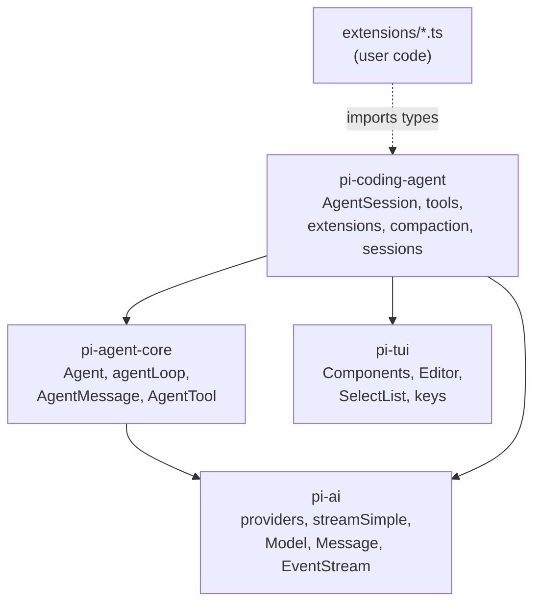
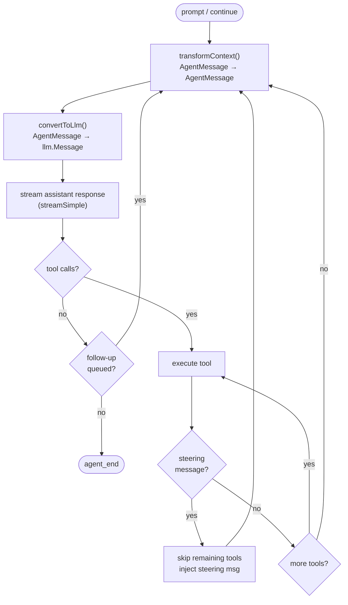
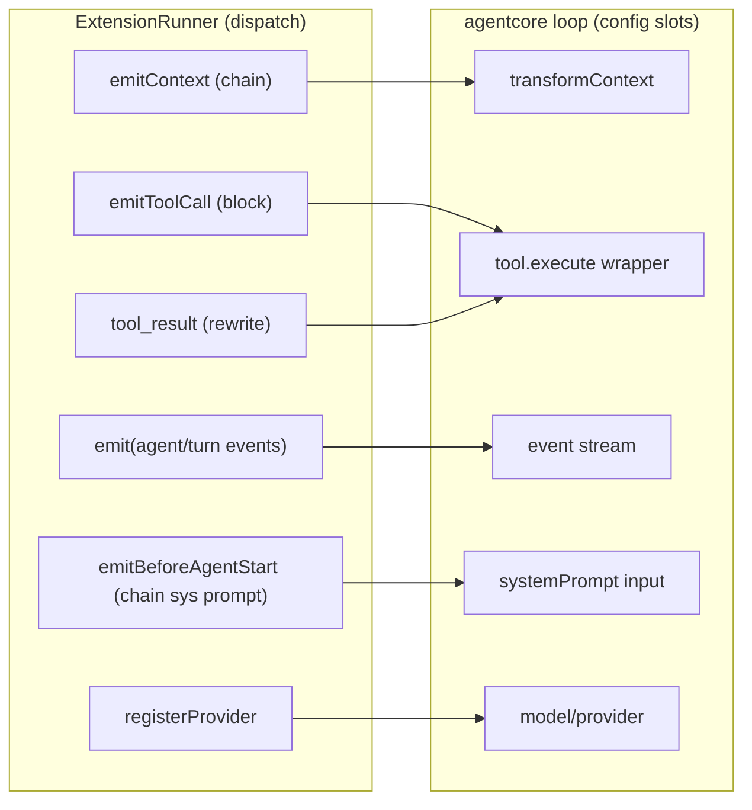
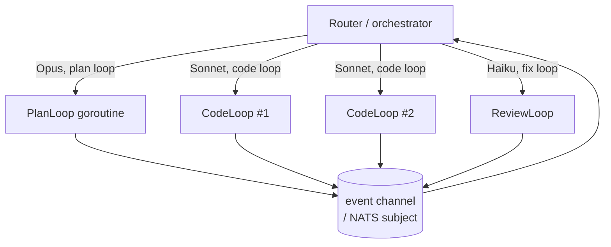

# Pi Harness — Architecture & Go Translation

> Companion to [[harness-in-go-design]]. This is the "how it actually wires
> together" deep-dive: the loop, the package API surface, where the extension
> points physically live, and what Go buys us.

> [!abstract] TL;DR
> The harness is three rings: **loop (mechanism)** → **session (wiring)** →
> **extensions (policy)**. Extensions don't hook "the loop" abstractly — they
> plug into **named slots** on the loop's config (`transformContext`, tool
> wrappers) plus the event stream. In Go those slots are struct fields / an
> interface, and the Starlark host is what fills them.

---

## 1. Package map & dependency graph



> [!note] The one rule
> `pi-agent-core` imports **only** `pi-ai`. It has zero knowledge of tools-on-disk,
> the TUI, sessions, or extensions. Everything product-shaped lives in
> `pi-coding-agent` and *consumes* the loop. Preserve this seam in Go:
> `agentcore` never imports `codingagent` or `ext`.

### API surface, one line each

| Package | Exports (the surface that matters) | Go home |
|---|---|---|
| `pi-ai` | `Model`, `Message`, `streamSimple`, `Api` registry, provider clients, `EventStream`, OAuth | `llm/` |
| `pi-agent-core` | `Agent` class, `agentLoop`/`agentLoopContinue`, `AgentMessage`, `AgentTool`, `AgentEvent`, `AgentLoopConfig` | `agentcore/` |
| `pi-tui` | `Component`, `Editor`, `SelectList`, `Text`, `Markdown`, `Key`/`matchesKey`, themes | `tui/` |
| `pi-coding-agent` | `AgentSession`, built-in tools, `ExtensionAPI`/`ExtensionRunner`, compaction, session manager, model registry | `codingagent/` + `ext/` |

---

## 2. The loop (mechanism ring)

The loop is `agentLoop()` in `pi-agent-core`. The `Agent` class is a thin
stateful wrapper that owns the steering/follow-up queues and translates them
into the loop's config callbacks (`agent.ts:356-393`).



> [!tip] The two loops in one
> **Inner loop** = tool calls + *steering* (interrupt: drop remaining tools, inject
> now). **Outer loop** = *follow-up* (queue: continue after the agent would stop).
> In TS these are awaited queue-drains; in Go they're `select` on two channels.

The loop emits a typed **event stream** the whole time (`agent_start`,
`message_start/update/end`, `tool_execution_start/update/end`, `turn_end`,
`agent_end`). The UI is a pure subscriber — it never calls *into* the loop.

---

## 3. The wiring ring — where extension points physically attach

This is the part that's invisible until you read `sdk.ts` + `agent-session.ts`.
Extensions do **not** patch the loop. The host constructs the `Agent` with the
extension runner's methods *as* the loop's config slots:

```ts
// sdk.ts:287 — the actual wiring
agent = new Agent({
  convertToLlm:     convertToLlmWithBlockImages,           // host policy
  transformContext: (msgs) => runner.emitContext(msgs),    // ← "context" hook lives HERE
  getApiKey:        (provider) => modelRegistry.getKey(provider),
  steeringMode, followUpMode, thinkingBudgets, ...
});
```

And tools are wrapped before `agent.setTools()`:

```ts
// agent-session.ts:1934-1968
const registered = runner.getAllRegisteredTools();          // from pi.registerTool
const tools = wrapRegisteredTools(registered, runner)       // RegisteredTool → AgentTool
  .map(t => wrapToolWithExtensions(t, runner));             // ← "tool_call"/"tool_result" fire HERE
agent.setTools(tools);
```

So every extension capability maps to a **specific slot**:



### The extension-point table (the cheat sheet)

| pi hook (`pi.on(...)`) | Loop slot it fills | Combine policy | Go: where you add it |
|---|---|---|---|
| `context` | `LoopConfig.TransformCtx` | **chain** msgs | `cfg.TransformCtx = runner.EmitContext` |
| `tool_call` | inside tool wrapper, pre-exec | **block**/short-circuit | wrap `Tool.Execute`; check `runner.EmitToolCall` |
| `tool_result` | inside tool wrapper, post-exec | **rewrite** result | same wrapper, after exec |
| `before_agent_start` | system-prompt input | **chain** prompt | call `runner.EmitBeforeAgentStart` before `Run()` |
| `agent_start/end`, `turn_start/end` | event-stream subscriber | fan-out | goroutine ranging the event chan → `runner.Emit` |
| `input`, `user_bash` | pre-loop input pipeline | transform/handle | in the session layer, before `Run()` |
| `registerTool` | `LoopConfig.Tools` | additive | append to tools slice before `Run()` |
| `registerProvider` | model registry | additive | `modelRegistry.Register(...)` (compiled-in Go) |

> [!important] The Go translation is *mechanical*
> You don't invent extension points — you expose the loop's existing config
> slots to the runner, and expose the runner's surface to Starlark. Three rings,
> two adapters.

---

## 4. Extensibility with Starlark — what we offer devs

### What a third-party dev writes

A `.star` file dropped in `.pi/extensions/` (mirrors pi's discovery in
`loader.ts:433`). No compile step, hot-reloadable, sandboxed:

```python
# .pi/extensions/guard.star — block edits to protected paths, add a tool

def on_tool_call(ev, ctx):
    if ev.tool_name == "edit" and ev.input["path"].startswith("infra/"):
        return {"block": True, "reason": "infra/ is protected"}

def wc(call_id, args, ctx):
    res = ctx.exec("wc", ["-l", args["file"]])
    return {"content": [{"type": "text", "text": res.stdout}]}

def setup(pi):
    pi.on("tool_call", on_tool_call)
    pi.register_tool(
        name        = "line_count",
        description = "Count lines in a file",
        parameters  = {"type": "object",
                       "properties": {"file": {"type": "string"}},
                       "required": ["file"]},
        execute     = wc,
    )
```

That's the **logic-plane** — interception + new tools + shelling out. It covers
~80% of real extensions (pi's own `diff.ts` is mostly this: `git status` + a
picker).

### Where in Go the extension point lives — concretely

```mermaid
sequenceDiagram
    participant Disc as discoverExtensions()
    participant Host as ext.StarlarkHost
    participant SL as starlark.ExecFile
    participant Ext as *Extension (record)
    participant Run as ExtensionRunner
    participant Loop as agentcore.Run

    Disc->>Host: Load(".pi/extensions/guard.star")
    Host->>SL: predeclared = {"pi": piModule}
    SL->>Ext: setup(pi) mutates handlers/tools maps
    Note over Host,Ext: PHASE 1 — registration. action builtins error (Runtime=nil)
    Host->>Run: bind(liveRuntime)
    Note over Run: PHASE 2 — actions now live
    Loop->>Run: TransformCtx / tool wrapper / events
    Run->>SL: starlark.Call(handler, ev, ctx)
```

The physical insertion points in Go:

1. **`ext/host.go`** — owns the `*starlark.Thread` and the `pi` module of
   Go-implemented builtins (`pi.on`, `pi.register_tool`, `pi.exec`, …). Each
   builtin parses Starlark args → calls the host-side `ExtensionAPI`.
2. **`ext/extension.go`** — the `*Extension` record: `handlers map[string][]starlark.Callable`,
   `tools map[string]Tool`, etc. `pi.register_*` mutate this. (= pi's
   `loader.ts` Extension object.)
3. **`ext/runner.go`** — `Emit*` walks extensions, invokes handlers via
   `starlark.Call`, applies the per-event combine policy (chain/block/rewrite).
   (= pi's `runner.ts`.)
4. **`codingagent/session.go`** — the wiring: sets `cfg.TransformCtx = runner.EmitContext`,
   wraps tools, subscribes a goroutine to the event channel → `runner.Emit`.
   (= pi's `sdk.ts` + `agent-session.ts`.)

> [!note] Two-phase wiring (don't skip this)
> `pi.register_*` run at load and only build maps. Action builtins
> (`pi.send_message`, `pi.set_model`) read a `*Runtime` from
> `thread.Local("runtime")`; it's `nil` during load → they error, exactly like
> pi's "throwing stubs → bindCore()" pattern (`loader.ts:107` → `runner.ts:192`).

### The seam Starlark can't cross — and the workaround

`diff.ts` also renders a live `SelectList` `Component`. Starlark can't hold a Go
pointer to a component. So the host owns rendering; Starlark gets a **declarative**
builtin:

```python
choice = ctx.ui.select("Select file to diff", labels)   # host renders, returns value
```

pi already supports the `string[]` form of `setWidget` (`types.ts:123`), so this
isn't a downgrade of the model — just of *who owns the pixels*. Truly custom UI
or custom providers stay **compiled-in Go** behind an interface; cross-language /
heavy extensions go through **MCP** (subprocess JSON-RPC).

---

## 5. Main harness components — Pi → Go translation

| # | Pi component | Responsibility | Go target |
|---|---|---|---|
| 1 | `agentLoop` | the turn loop, tool exec, steering/follow-up | `agentcore.Run` (goroutine + 2 chans) |
| 2 | `Agent` class | state + queues + event fan-out | `agentcore.Agent` struct |
| 3 | `AgentMessage` + `convertToLlm` | the LLM boundary | union iface + `ConvertToLLM` func |
| 4 | `EventStream` | typed event push | `chan AgentEvent` |
| 5 | `AgentTool` + validation | tools as data, errors as values | `Tool` struct, `(ToolResult, error)` |
| 6 | `streamSimple` + providers | provider I/O | `llm.StreamFn` + provider clients |
| 7 | `ExtensionRunner` | dispatch + combine policy | `ext.Runner` |
| 8 | `loader` (jiti) | discover + load extensions | `ext.Host` (Starlark) |
| 9 | `ExtensionAPI` | the `pi.*` surface | Go builtins module |
| 10 | `AgentSession` | wiring + sessions + commands | `codingagent.Session` |
| 11 | compaction | context-window management | `transformContext` impl |
| 12 | model registry / auth | provider + key resolution | `llm.Registry` + `GetAPIKey` |
| 13 | TUI | render the event stream | `tui/` (bubbletea-style) |

Build order (from [[harness-in-go-design]] §7): **1→3→6→9→runner→UI seam→MCP**.

---

## 6. Why Go — beyond "single binary"

> [!success] The interesting part: Go lets the harness itself be plural.
> In pi the loop is one shape. In Go, because the loop is a stateless function of
> `LoopConfig` and providers are an interface, you can run **many loops with
> different models/harnesses concurrently** — cheaply (goroutines, ~KBs of stack),
> in one process.

Concrete flows this unlocks:

| Benefit | Mechanism | Example flow |
|---|---|---|
| **Per-flow model routing** | `LoopConfig.Model` is just a field | Planner runs Opus; the 5 parallel implementers run Sonnet; the linter-fixer runs Haiku — all in one binary. |
| **Multiple harness *shapes*** | `Run` is a func; write variants | A `PlanLoop` (no tools, think-only), a `CodeLoop` (full tools + steering), a `ReviewLoop` (read-only tools). Same `agentcore`, different config. |
| **True concurrency** | goroutines + channels | Fan out N subagents, each its own loop + event chan; merge results. Steering = a channel send, not a promise dance. |
| **Cheap parallelism** | 30MB/agent vs ~150MB Node | 50 agents on one box becomes realistic (the NATS-mesh PRD's premise). |
| **Cross-compile** | `GOOS/GOARCH` | Ship the same harness to a Pi, a Mac, a CI runner — one file, no runtime. |
| **Embeddable infra** | import a library | Embed NATS/JetStream → agents form a mesh with no external broker (see `docs/prd-nats-agent-mesh.md`). |
| **Deterministic ext sandbox** | Starlark | Untrusted community extensions can't touch fs/net unless you grant a builtin — safer marketplace than `eval`-ing TS. |



> [!quote] The thesis
> TypeScript pi proves the *design*. Go doesn't just port it — it makes the
> harness a **value you can instantiate many times with different models and
> shapes**, which is exactly what multi-agent flows need. The extension system
> stays just as powerful for the logic-plane (Starlark), trades raw-UI power for
> a declarative protocol, and gains a real sandbox.

---

## 7. Open questions to resolve next

- [ ] Starlark builtin surface: full `pi.*` list + which are load-phase vs runtime.
- [ ] Declarative widget protocol spec (what shapes `ctx.ui.*` accepts/returns).
- [ ] Schema story: JSON Schema vs a Go struct-tag generator for tool params.
- [ ] Provider interface in `llm/` — start with Anthropic Messages.
- [ ] Do we want WASM as a second extension tier, or is Starlark + MCP enough?
