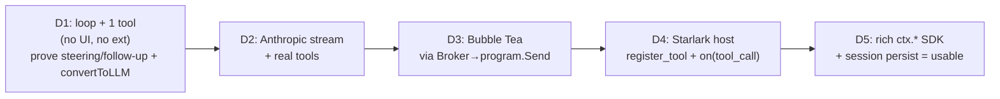
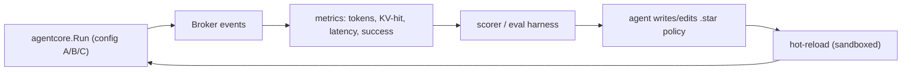

# Pi-in-Go Harness — Spec & Roadmap

> The consolidated, actionable spec. Companion to [[harness-in-go-design]] (the
> *why*), [[harness-architecture]] (the *how it wires*), and
> [[prd-nats-agent-mesh]] (the *mesh endgame*). This doc answers: **what ships
> first**, and **where we innovate after**.

**Status:** Draft for build · **Date:** 2026-06-13

---

# Part I — The Wedge (what ships first)

> [!abstract] Wedge statement
> **A single static Go binary: pi's agent loop + a Bubble Tea TUI + Starlark
> tools, in-process only.** No broker, no WASM, no mesh. It must be usable on day
> one with zero infra, and it must de-risk the two hardest seams — *loop ↔ UI*
> (via `Broker[T]`) and *core ↔ Starlark* — before any mesh ambition.

The mesh, WASM, NATS, and multi-frontend work are **delivery N, not delivery 1.**
Everything in the architecture doc is designed so they bolt on *without* reworking
the wedge (the `Transport` interface defaults to in-process; the UI is already a
`Workspace` client).

### In scope (Delivery 1)

- `agentcore` loop: turn loop, tool exec, **steering + follow-up channels**, the
  `convertToLLM` boundary, `transformContext` hook.
- `llm/`: one provider, streaming (Anthropic Messages). `GetAPIKey` for expiring tokens.
- Built-in tools: `read`, `write`, `edit`, `bash`, `grep` — as Go `Tool` values.
- `ext/`: Starlark host — `pi.register_tool`, `pi.on("tool_call"|"context")`, a
  **rich structured `ctx.*` SDK** (git/fs/exec), two-phase stub→bind wiring.
- `pubsub.Broker[T]` (lossy `Publish` + `PublishMustDeliver`) → fan-in →
  `program.Send` → **Bubble Tea** root model (chat/status), lipgloss + glamour.
- `Workspace` interface with the **in-process** impl only.
- JSONL session persistence.

### Out of scope (deferred, by design)

| Deferred | Unblocks later via |
|---|---|
| NATS / embedded broker / mesh | `Transport` iface (swap in-process → NATS) |
| WASM extension tier | same extension contract, new loader |
| Remote / web / IDE frontends | `Workspace` client impl over socket |
| Custom providers, OAuth | compiled-in provider registry |
| Compaction / memory hierarchy | `transformContext` (Part II) |
| Self-writing extensions | sandboxed Starlark + hot-reload |

### Package layout

```
cmd/pi/            main — wire app, run Bubble Tea program
agentcore/         loop, AgentMessage, Tool, AgentEvent, LoopConfig
llm/               Model, Message, StreamFn, anthropic provider
ext/               Starlark host, Extension record, Runner (dispatch)
ext/sdk/           the rich ctx.* builtins (git/fs/exec/ui)
tui/               Bubble Tea root model + sub-models (Charm spine)
pubsub/            Broker[T] (copied pattern from Crush)
transport/         Transport iface + InProcess impl
session/           JSONL persistence
```

### Milestones



### Definition of done (Delivery 1)

- [ ] `pi "edit X and run tests"` works end-to-end against Anthropic.
- [ ] User can interrupt mid-tool (steering) and queue follow-ups.
- [ ] A `.star` file in `.pi/extensions/` can add a tool and block a `tool_call`.
- [ ] Streaming renders without flicker; terminal events never dropped.
- [ ] Single `go build` → one static binary, no runtime deps.

### Beyond the wedge (delivery order)

`InProcess` everything → **2.** compaction + caching (Part II, pure wins) →
**3.** WASM tier → **4.** `Transport=NATS` + supervised services → **5.** mesh +
alternate frontends. Each step is additive; none rewrites the wedge.

---

# Part II — The Optimization & Novel-Harness Frontier

> [!abstract] The core claim
> Because the loop is a **pure function of its config** and **everything emits
> events**, this harness is a *research instrument*: you can swap a strategy, hold
> everything else fixed, and measure. The 2026 literature on "harness engineering"
> (e.g. *Agentic Harness Engineering*, *Natural-Language Agent Harnesses*) argues
> the **control stack — state, context curation, folding — bottlenecks performance
> even with the model fixed.** That control stack is exactly what we own.

### The seam map — every optimization plugs into a slot we already built

| Optimization area | Technique (lit.) | Where it plugs | Go edge |
|---|---|---|---|
| Context management | context-as-tool, active curation (ARC, *Memory as Action*) | `transformContext` + a Starlark-registered tool | hot-swap strategies as `.star` |
| Prompt / KV caching | stable-prefix, cache-aware ordering | `convertToLLM` boundary | determinism → stable prefixes |
| Token efficiency | tool-output truncation, sub-agent isolation | tool wrapper + child loops | goroutine sub-agents are cheap |
| Long-run compression | hierarchical memory, context-folding, RE-TRAC | `transformContext` + session tree | parallel candidate summaries |
| Sandboxing | capability isolation, microVM | tiered ext model (§ arch) | Starlark/WASM/NATS-authz |
| Self-tuning harness | observability-driven evolution | `Broker` taps + self-written `.star` | cheap parallel A/B + sandbox |

### 1. Context management → `transformContext`

This single hook (AgentMessage-level transform before `convertToLLM`) is **the**
context-engineering surface. pi's compaction already lives here. The frontier:
treat context curation as a **first-class action the agent invokes** (*Memory as
Action*, *Context as a Tool*) — register `compress`, `retrieve`, `forget` as
Starlark tools, so the *model* decides when to curate, and we A/B the policy.

### 2. Prompt / KV caching → `convertToLLM` + stable prefixes

The single highest-ROI lever. KV-cache hit rate is *the* production agent metric:
Anthropic cached tokens are **~90% cheaper**; agents re-send the whole history
every turn. Rule: **static content first (system + tool defs), volatile last;
never mutate the prefix** (no timestamps in system prompt, no tool-order shuffling).
Because `convertToLLM` is the *one* place messages are assembled, we can **enforce
cache-stable ordering centrally** and instrument the hit rate. Go's determinism
(no incidental reordering) is an asset here.

### 3. Token efficiency → tool wrapper + sub-agent isolation

- **Truncate tool outputs at the wrapper** (cap bytes/lines; cascade: compress
  output → sliding window → LLM-summarize only as last resort — the reliable
  multi-layer order from the memory survey).
- **Sub-agent isolation**: detailed work happens in a child loop; only a condensed
  1–2k-token summary returns to the parent. In Go a sub-agent is *another goroutine
  running `agentcore.Run` with its own event channel* — first-class and cheap,
  versus pi's subprocess-per-subagent.

### 4. Long-running compression → hierarchical memory

Production-grade pattern (from the surveys): **working memory** (recent turns,
active files) → **compressed memory** (older turns/inactive files as summaries) →
**architectural memory** (global structure). Plus **context-folding** (collapse
completed sub-trajectories) and **recursive trajectory compression** (RE-TRAC).
All are `transformContext` strategies; pi's session-tree + branch summaries already
give us the substructure to fold into. Go win: run several candidate folds in
parallel, keep the best by a cheap scorer.

### 5. Sandboxing modules → the tiered extension model

Already designed (arch §11–12): **Starlark** (deny-by-default, the safe target for
agent-authored extensions), **WASM** (capability-gated host functions), **NATS
subject authz**, and OS **microVM** for the untrusted heavy case (cf. Crush's
`gondolin`). The differentiator vs pi: capability isolation is a *property of the
system*, not a per-extension bolt-on.

### 6. The novel bet — a self-optimizing harness

> [!success] What this architecture uniquely enables
> Combine three things we already have: (a) **observability for free** — every turn
> emits `Broker` events, so token cost, KV-hit rate, tool latency, and task outcome
> are all tappable; (b) **sandboxed self-modification** — the agent writes Starlark
> *policies* (context strategy, tool gating, compaction triggers) that hot-reload
> and **cannot** harm the host; (c) **cheap parallel loops** — run N policy variants
> concurrently and keep the winner. That is an **observability-driven, automatically
> evolving harness** (exactly the *Agentic Harness Engineering* and
> *Natural-Language Agent Harnesses* direction) — buildable here because the loop is
> pure config, the bus is built in, and the extension language is safe to generate.



### Go-specific edges for the frontier

| Edge | Why it matters for research |
|---|---|
| Goroutines/channels | parallel sub-agents & candidate strategies are nearly free → real-time harness search |
| Single static binary | reproducible benchmark artifact; ship the instrumented harness as one file |
| Built-in `Broker` | observability/tracing is a tap on the event stream, not bolt-on |
| Determinism + static types | stable prompt prefixes (cache) + reproducible evals |
| Memory footprint (~30MB) | long sessions + many loops on one box |
| Embedded everything (NATS opt.) | the eval mesh *is* the product mesh — no separate infra |

### Open research threads

- [ ] Cache-stable message ordering as an enforced invariant in `convertToLLM` —
      can we guarantee it and surface hit-rate live?
- [ ] Context-folding *policy* as a generated Starlark artifact — what's the scorer?
- [ ] Sub-agent summary budget vs. fidelity — measurable sweet spot?
- [ ] A benchmark harness (SWE-EVO / LoCoBench-Agent style) wired to the `Broker`.
- [ ] Does self-evolution converge or oscillate? Guardrails on auto-edited policies.

---

## Appendix — references (2025–2026)

- *Agentic Harness Engineering: Observability-Driven Automatic Evolution of
  Coding-Agent Harnesses* — arXiv 2604.25850
- *Natural-Language Agent Harnesses* — arXiv 2603.25723
- *Memory as Action: Autonomous Context Curation for Long-Horizon Agentic Tasks* —
  arXiv 2510.12635
- *Context as a Tool: Context Management for Long-Horizon SWE-Agents* — arXiv 2512.22087
- *RE-TRAC: Recursive Trajectory Compression for Deep Search Agents* — arXiv 2602.02486
- *Building Effective AI Coding Agents for the Terminal* — arXiv 2603.05344
- *Rethinking Memory Mechanisms of Foundation Agents: A Survey* — arXiv 2602.06052
- *SWE-EVO* (long-horizon coding benchmark) — arXiv 2512.18470;
  *LoCoBench-Agent* — arXiv 2511.13998
- Anthropic — *Effective context engineering for AI agents* (eng blog)
- Techniques: MemGPT, RAPTOR, GraphRAG, Self-RAG; prompt/KV caching (vLLM, llm-d)
