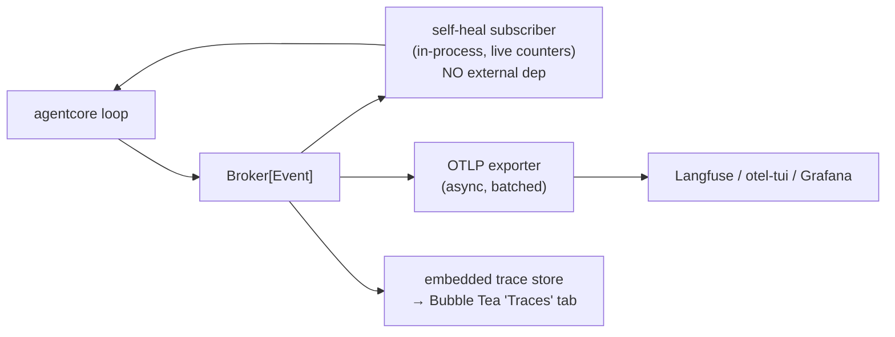

# Observability & Self-Healing

> Baked-in, lightweight tracing for the harness — and why "the harness watching
> itself" needs no external infra. Companion to [[caching-and-control-surface]].

> [!abstract] One source, two sinks
> The event `Broker` (see [[harness-architecture]] §15) is the single source of
> truth. **Observability export** and **self-healing** are two *independent
> subscribers* with different latency budgets. Don't couple them.



---

## 1. Self-healing needs nothing external

Self-heal / self-improve is a **local Broker subscriber** holding live metrics —
cost trajectory, loop-repeat signals, tool failure rates — that feeds back into
`LoopConfig`/policy in real time. It must **never wait on a network export**. So it
has zero dependency on OTel, Langfuse, or a collector. The human-facing trace export
is a *separate* concern. Same events, different sinks.

---

## 2. Export: SDK exporter, not a Collector

- **OTel SDK + OTLP exporter** = a library; create spans in-process, async-batched
  export. Microsecond span creation, off the hot path. **Bake this in.**
- **OTel Collector** = a separate daemon for sampling/redaction/fan-out at scale.
  **Do not embed** in the binary; defer to mesh scale, and even then run it as a
  sidecar / NATS-attached node, not compiled in.

**Langfuse has a native OTLP endpoint** (`/api/public/otel`) that understands the
GenAI semantic conventions — so a standard OTel Go exporter ships straight to it,
no Langfuse-specific SDK, no lock-in. The same spans also go to Grafana/Tempo/
Honeycomb/Jaeger by changing one env var.

Put it behind an `Exporter` interface, **off by default** (env/flag-gated):

```
Exporter:  Noop (default) | OTLP(endpoint) | LocalJSONL
```

Map the loop's `context.Context` to a span tree: session = trace, turn = span,
LLM call = child span (`gen_ai.system`, `gen_ai.request.model`, `gen_ai.usage.*`,
cost), tool call = child span. The tree forms automatically.

> [!warning] The real cost isn't CPU — it's PII & cardinality
> Prompts/completions in spans are a privacy + storage concern. Redact, sample, and
> make content capture opt-in. Keep tracing off by default to preserve the lean,
> private, single-static-binary story.

---

## 3. The baked-in "Traces" tab (the differentiator)

> [!note] There is no embeddable Go-native Langfuse
> Langfuse is a TS server needing Postgres + ClickHouse + Redis + S3 — you can only
> *send to* it (Go pkgs like `henomis/langfuse-go`, `optible/langfuse-go` are
> clients). OpenObserve (single-binary) is **Rust**, a separate server. Phoenix is
> Python. The closest Go prior art is **[`otel-tui`](https://github.com/ymtdzzz/otel-tui)** —
> a terminal OTel viewer (embedded OTLP receiver + in-memory store + trace/span
> TUI). It proves the TUI piece is tractable in Go.

So we don't embed Langfuse — we **assemble a small, agent-native trace subsystem**:

```
Broker → trace store (embedded) → Bubble Tea "Traces" tab   (flip a flag)
                                 → programmatic: query store / local socket API
```

**Why ours beats a generic viewer:** our traces come from our *own* Broker, so we
model agent-native concepts a generic OTel UI can't — **turns, forks, steering
interrupts, compaction events, tool sub-trees, cost-per-turn, run-to-run
comparisons.** Keep this rich native model internally; **flatten to `gen_ai.*` only
on OTLP export.** Bespoke TUI *and* zero lock-in.

---

## 4. Staged plan (defer past the wedge)

| Stage | Observability |
|---|---|
| **Wedge (D1)** | none / `LocalJSONL` only |
| **Today, free** | OTLP exporter → run **`otel-tui`** locally (or Langfuse) — zero build |
| **Delivery 2–3** | embedded **Traces tab** (Broker → store → Bubble Tea), agent-native model + fork/compare |
| **Mesh scale** | one Collector node (sidecar / NATS-attached), central sampling/redaction |

> [!tip] The plumbing is easy; the UX is the value
> Emitting + storing spans is small (events already flow). The trajectory / fork /
> compare *interface* is product design — and it's only possible because we own the
> event model. That's where to spend the effort.

Storage choice for the embedded store is its own decision — see [[storage-and-cgo]].
