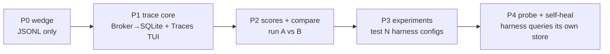

# Lightweight OTel Core — Gameplan

> Baking a *very* lightweight trace core into the binary, grounded in how Langfuse
> actually models agent traces — then expanding it to compare harnesses and let the
> harness probe/self-heal. Builds on [[observability-and-self-healing]] and
> [[storage-and-cgo]].

---

## 1. What Langfuse's data model actually is (it's tiny)

Cloned and analyzed. The entire trace model is **three tables** (Langfuse stores
them in ClickHouse because it's multi-tenant SaaS at scale — irrelevant to us):

| Table | = | Key fields |
|---|---|---|
| **traces** | one agent run / session | `id, timestamp, name, session_id, user_id, input, output, metadata, tags, bookmarked` |
| **observations** | the spans (a **tree**) | `id, trace_id, parent_observation_id, type(SPAN\|GENERATION\|EVENT), start_time, end_time, name, level, status_message, input, output, model, model_parameters, usage_details{tokens}, cost_details + total_cost, completion_start_time(TTFT), prompt_name/version` |
| **scores** | evals / feedback | `id, trace_id, observation_id?, name, value(float), string_value, data_type, source(API\|EVAL\|HUMAN\|ANNOTATION), comment` |

That's the whole thing: **trace → tree of observations (with token usage + cost) →
scores.** `GENERATION` = an LLM call; `SPAN` = a tool/sub-step; `EVENT` = a marker.

> [!tip] Two takeaways
> 1. The model is small enough to **replicate the essence in 3 SQLite tables** — no
>    ClickHouse, no Postgres, no Redis.
> 2. It maps cleanly onto **our `Broker` events** *and* **OTel GenAI semconv**:
>    `agent_start`→trace, turn/tool/llm→observations, usage/cost→`gen_ai.usage.*`.
>    The `scores` layer is the part OTel lacks — and it's exactly what powers
>    compare/self-heal.

---

## 2. Our core model (3 tables, pure-Go SQLite)

```sql
-- modernc.org/sqlite (pure Go), WAL + busy_timeout, single-writer goroutine
CREATE TABLE traces(
  id TEXT PRIMARY KEY, session_id TEXT, name TEXT, ts INTEGER,
  input TEXT, output TEXT, meta JSON, tags JSON);
CREATE TABLE observations(
  id TEXT PRIMARY KEY, trace_id TEXT, parent_id TEXT,
  type TEXT, name TEXT, start_ns INTEGER, end_ns INTEGER,
  level TEXT, status TEXT, input TEXT, output TEXT,
  model TEXT, usage JSON, cost REAL, ttft_ns INTEGER);
CREATE TABLE scores(
  id TEXT PRIMARY KEY, trace_id TEXT, observation_id TEXT,
  name TEXT, value REAL, string_value TEXT, source TEXT, comment TEXT);
CREATE INDEX ix_obs_trace ON observations(trace_id);
CREATE INDEX ix_obs_parent ON observations(parent_id);
CREATE INDEX ix_score_trace ON scores(trace_id);
```

Fed by a `Tracer` that subscribes to the `Broker`. Same model serializes to OTLP
GenAI spans for export — internal model rich, export flattened.

### Why SQLite here and not Badger

The trace workload is **query/analytics-shaped**: *filter by session, range by time,
aggregate cost per run, join scores, compare run A vs B.* That's SQL's home turf and
Badger's weakness (KV → you'd hand-roll every secondary index + aggregation). And
Badger's one advantage — **concurrent writes** — buys us nothing here, because traces
are written by **one harness process / one writer goroutine**. So: SQLite for the
*queryable trace store*; reserve Badger for *concurrent KV* and JetStream for *mesh
state* (see [[storage-and-cgo]]). Match the tool to the workload.

---

## 3. Phased gameplan



**P1 — Trace core (the lightweight win).** `Tracer` subscribes to `Broker` → writes
the 3 tables. `--trace` flag (off by default). `pi traces` Bubble Tea view: list runs
(session, duration, tokens, cost), drill into the **observation tree** (turns → tool/
LLM spans), per-span tokens/cost/TTFT. Optional `OTLP` exporter for Langfuse/otel-tui.
*This alone is the "see our traces" story.*

**P2 — Scores + compare.** Populate `scores` (cost, turns, success, latency, custom
evals). `pi traces compare <A> <B>` → side-by-side trajectory + metric diff. This is
where a bespoke UI beats Langfuse for *agent* work (fork/compare trajectories).

**P3 — Experiment runner ("test various harnesses").** A `dataset` of tasks + a
`run` = (harness config × dataset). Execute N configs (model, context strategy,
tool set, compaction policy) over the same tasks — cheap via goroutines — write a
trace + scores per item, then compare runs. This is the harness-tuning loop.

**P4 — Probe + self-heal.** The *same* store, queried in-process: a subscriber asks
"am I looping? cost spiking? this tool failing repeatedly?" and feeds `LoopConfig`/
policy. No network, no Langfuse — just SQL over the local store the events already
filled. Programmatic access = the store API (or the local socket).

---

## 4. Interfaces & non-goals

```
type Tracer interface { /* Broker subscriber → store + optional OTLP */ }
type TraceStore interface {
  WriteTrace / WriteObservation / WriteScore
  ListTraces(filter) / GetTree(traceID) / CompareRuns(a,b) / Query(sql)
}
type Exporter interface { Noop | OTLP(endpoint) }   // off by default
```

> [!warning] Keep it lightweight — explicit non-goals
> No ClickHouse, no Postgres, no Redis, no multi-tenant, no web app, no auth, no
> dataset-versioning UI. Those are Langfuse's SaaS concerns. We want: 3 tables, a
> Bubble Tea tab, an optional OTLP exporter, and a queryable store the harness can
> probe. Everything past P2 is additive and stays behind flags.

> [!note] The through-line
> traces/observations/scores in SQLite (local) → the *same* shapes ride OTLP to
> external tools, and the *same* shapes live in JetStream KV when the mesh needs
> them shared. One model, three reaches: local, exported, distributed.
